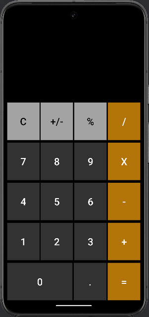

# iOS CALCULATOR APP
- In this project, I built an iOS calculator app clone using Android Studio and Kotlin.
- The application was designed to mimic the functionality of an iOS calculator, including operations like addition, subtraction, multiplication, and division.
- I used Kotlin, a statically typed programming language that runs on the Java Virtual Machine (JVM) and can be used to develop applications and the user interface of the calculator was designed using XML.
- This project demonstrates my skills in mobile app development, understanding of Kotlin and XML, and my ability to effectively use Android Studio for app development.

## Functionality
The following **required** functionality is completed:
- [x] User sees a numeric keypad to input numbers, which includes digits from 0 to 9.
- [x] User can perform basic arithmetic operations like addition (+), subtraction (-), multiplication (x), and division (/).
- [x] User can clear the current input using the ‘C’ button.
- [x] User can change the sign of the number from positive to negative or vice versa with the ‘+/-’ button.
- [x] User can calculate percentages using the ‘%’ button.
- [x] User can enter decimal numbers using the ‘.’ button.
- [x] User gets results by pressing the ‘=’ button and then the user can press another operation.
- [x] User can see the result of the previous operation when an operation button (like ‘-’) is pressed. This result remains visible until the user starts entering a new number.

## Extensions
The following **extensions** are implemented:
- **libs.plugins.android.application:** This is a plugin that provides all the necessary Android-specific configurations for your project.
- **libs.plugins.jetbrains.kotlin.android:** This is a Kotlin plugin that adds Android-specific functionality to your project.
- **libs.androidx.core.ktx:** This is a set of Kotlin extensions that are included as part of Android Jetpack. ‘ktx’ stands for Kotlin Extensions.
- **libs.androidx.appcompat:** This is a library that provides backward-compatible versions of Android components.
- **libs.material:** This is a library that provides Material Design UI components.
- **libs.androidx.activity:** This is a library that provides components to help manage your app’s activities.
- **libs.androidx.constraintlayout:** This is a library that provides a flexible layout manager for your app, allowing you to create large and complex layouts with a flat view hierarchy.
- **libs.junit:** This is a testing framework for Java programming language.
- **libs.androidx.junit:** This is a library that provides a set of APIs that allows writing JUnit 4 style tests for Android.
- **libs.androidx.espresso.core:** This is a library that provides APIs for writing UI tests for Android.

## Video Walkthrough
Here's a walkthrough of implemented user stories:

GIF created with [LiceCap](http://www.cockos.com/licecap/).

## Notes
- I endeavored to emulate both the layout and color theme of an iOS calculator app.
- I encountered some challenges with the Kotlin Android extensions and the binding of the XML to the Kotlin file. However, I was able to swiftly find a solution.

## License

    Copyright [2024] [Rohan Vasantbhai Darji]

    Licensed under the Apache License, Version 2.0 (the "License");
    you may not use this file except in compliance with the License.
    You may obtain a copy of the License at

        http://www.apache.org/licenses/LICENSE-2.0

    Unless required by applicable law or agreed to in writing, software
    distributed under the License is distributed on an "AS IS" BASIS,
    WITHOUT WARRANTIES OR CONDITIONS OF ANY KIND, either express or implied.
    See the License for the specific language governing permissions and
    limitations under the License.
